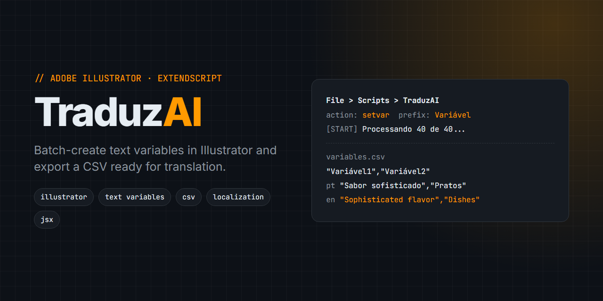

# TraduzAI: Adobe Illustrator script to batch-create text variables and export CSV for translation



**TraduzAI** is an Adobe Illustrator script (ExtendScript `.jsx` with a ScriptUI panel) for designers who localize artwork: it runs your "make text dynamic" Action in batches over the selected text objects, then exports every text to a UTF-8 CSV that you translate and load back as an Illustrator variable library.

Turning each text in a piece into an Illustrator variable by hand, one at a time, is slow and repetitive. TraduzAI does it for the whole selection, with a progress bar and a cancel button, and builds the CSV for you.

> Illustrator text variables · Illustrator translation script · export Illustrator text to CSV · multilingual design · localization workflow · Make Text Dynamic · data sets · ExtendScript JSX

## Features

- **Batch Action runner.** Runs a named Action on every selected object through `app.doScript`.
- **CSV export.** Writes a UTF-8 (with BOM) CSV: one header row of variable names (`Variável1`, `Variável2`...) and one row with the original text.
- **Export existing variables.** The **Exportar CSV Existente** button scans the variables already in the document and exports them.
- **Progress and cancel.** Live progress bar, cancel button, and a timeout prompt for long runs.
- **Safe on weak machines.** Processes at most 2 objects per batch with pauses between batches. Warns above 50 selected objects and asks again above 100.
- **Automatic backup.** Optional checkbox (on by default) that saves a `-backup.ai` copy before processing.
- **Any Illustrator language.** Action name, Action set and variable prefix are editable in the panel. See [LANGUAGE-CONFIG.md](LANGUAGE-CONFIG.md) for Action set names per language.

## Requirements

- Adobe Illustrator 2023 or newer (`package.json` declares `"illustrator": ">=2023"`; tested up to 2025)
- An Illustrator Action that converts the selected text into a variable

## Install

1. Copy `TraduzAI.jsx` into Illustrator's Scripts folder:
   - Windows: `C:\Program Files\Adobe\Adobe Illustrator [version]\Presets\[language]\Scripts\`
   - macOS: `/Applications/Adobe Illustrator [version]/Presets/[language]/Scripts/`
2. Restart Illustrator so it appears under **File > Scripts**.

## Usage

1. **Create the Action** once: open **Window > Actions**, create an Action (for example `setvar`), and record **Window > Variables > Make Text Dynamic** on a selected text object. Stop recording.
2. Open your document. Ungroup text if needed; ungrouped objects process more reliably.
3. Select the text objects and run **File > Scripts > TraduzAI**.
4. In the panel, set the Action name, the Action set and the variable prefix, choose whether to back up, and click **START**.
5. When processing finishes, accept the prompt to export the CSV.

```
File > Scripts > TraduzAI
> Action name: setvar
> Action set:  Ações Padrão
> Prefix:      Variável
> START
Processando 40 de 40...
Processamento concluído! Ação 'setvar' executada para 40 objetos.
Export CSV? [Yes]  ->  CSV saved
```

## Translation workflow

1. Run the script on the source-language text and export the CSV.
2. Add one new row per target language below the original row, keeping the header.
3. Translate with Google Sheets (its built-in translate function) or with an AI assistant, keeping the CSV rows intact.
4. Replace line breaks `\n` with `^n` in the translated text. Illustrator variables need `^n`.
5. In Illustrator, load the translated CSV as a variable library and switch between data sets in the Variables panel to apply each language.

CSV format:

```csv
"Variável1","Variável2","Variável3"
"Original text 1","Original text 2","Original text 3"
"Translation 1","Translation 2","Translation 3"
```

## Configuration

Defaults live at the top of `TraduzAI.jsx` and can also be changed in the panel:

| Constant | Default | Meaning |
|---|---|---|
| `ACTION_NAME` | `setvar` | Exact name of your Action |
| `ACTION_SET` | `Ações Padrão` | Action set name (e.g. `Default Actions` in English Illustrator) |
| `VARIABLE_PREFIX` | `Variável` | Prefix for CSV column names, numbered automatically |

The batch size limit of 2 (`Math.min(batchSize, 2)` in `TraduzAI.jsx`) is hardcoded on purpose and is not exposed in the UI.

## Troubleshooting

| Problem | Fix |
|---|---|
| "Action not found" | The Action name must match `ACTION_NAME` exactly |
| "Action set not found" | Set `ACTION_SET` to the name used by your Illustrator language |
| Accents look broken in Excel | Import the CSV choosing UTF-8 encoding |
| Line breaks do not work in Illustrator | Replace `\n` with `^n` in the translated text |
| Script freezes on large selections | Process smaller batches (50 to 100 objects) |

## Project structure

```
TraduzAI.jsx          # the script: ScriptUI panel, batch processing, CSV export
LANGUAGE-CONFIG.md    # Action set names and prefixes per Illustrator language
README-ptBR.md        # Portuguese documentation
TradutorCSVpy/        # legacy Python CSV translator (googletrans), separate docs, not part of the script flow
```

## FAQ

**Can the script create the Action for me?**
No. The Action must already exist in Illustrator before you run the script.

**Does TraduzAI translate the text itself?**
No. It prepares the variables and the CSV. You translate the CSV in a spreadsheet, with an AI assistant or with a translator, then load it back in Illustrator.

**My Illustrator is in English. What do I change?**
Set the Action set to `Default Actions` and, if you like, the prefix to `Variable`, either in the panel or at the top of `TraduzAI.jsx`.

**How many objects can I process at once?**
Any number, but the script recommends up to 50 per run on weaker machines and asks for confirmation above 50 and above 100.

## License

[MIT](LICENSE) © Wedny Fernandes
